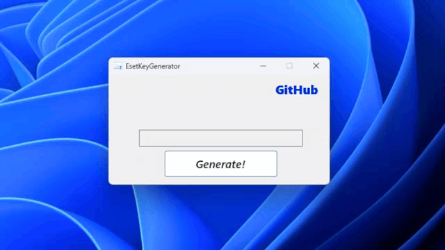
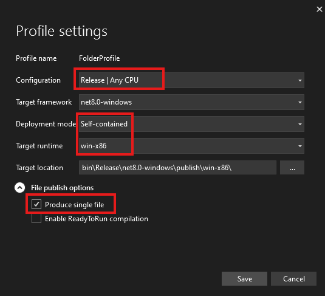
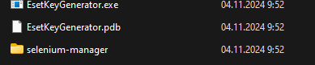

# ✨ ESET Key Generator: Fastest Key Generation ✨ 

This program generates keys for ESET Antivirus.

## Interface

## Features
- Quick start
- Key generation in less than a minute
- New features will be added over time

### DISCLAIMER 
***Use of this tool may not comply with ESET's terms of service. The authors and contributors are not responsible for any misuse or possible problems resulting from the use of this program. Please use it for evaluation and educational purposes only, and only on systems that you own or have permission to test.***

## How Does It Work?
The program registers an account with a free 30-day subscription and issues an activation key. Everything happens very quickly, and you don't have to waste time creating a new account or reinstalling your antivirus!

# Using the Program

You can run the installer, use a ready-made image, or create your own by downloading the source code.

## Starting the Installer

You can [install](https://github.com/FrostUNK/Eset_Key_Generator/releases/download/Installer/Setup.exe) the program so you always have it at your fingertips!

## Finished Image

Install it from the [Releases](https://github.com/FrostUNK/Eset_Key_Generator/releases/download/v1.0.0/Realese.zip)

## With the Code

You will need to select the project in the Solution Explorer, right-click, and publish. Then, configure the publishing settings to a folder. Specify the following in the publishing settings:

After you click publish, you will see two files: `esetkeygenerator.exe` and the `selenium-manager` folder.

Done and ready to use! The `.pdb` file can be deleted.
